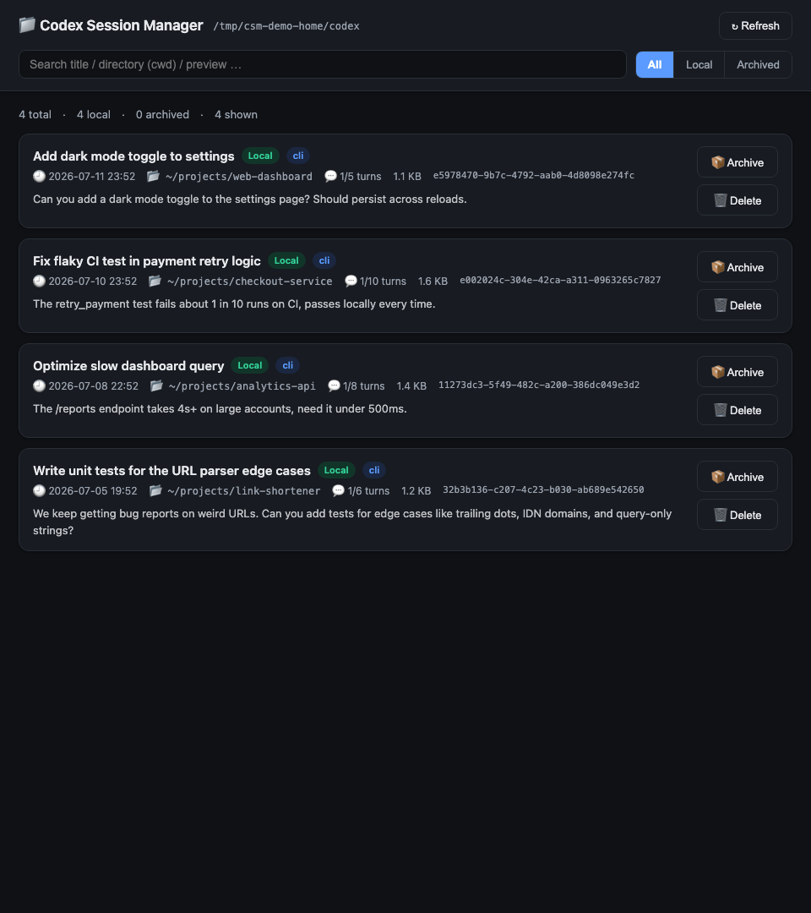
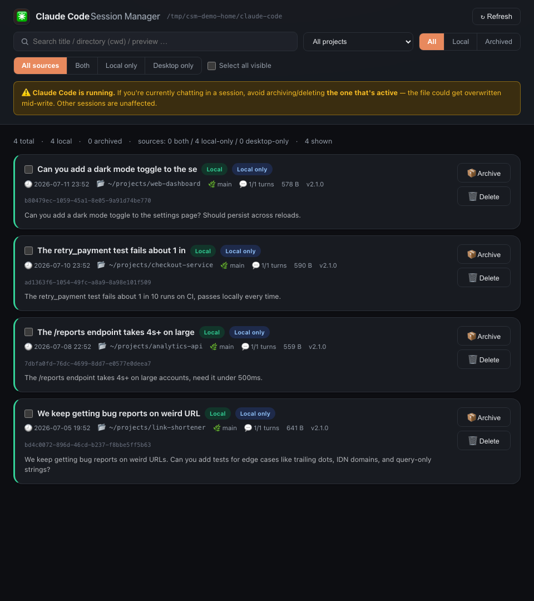
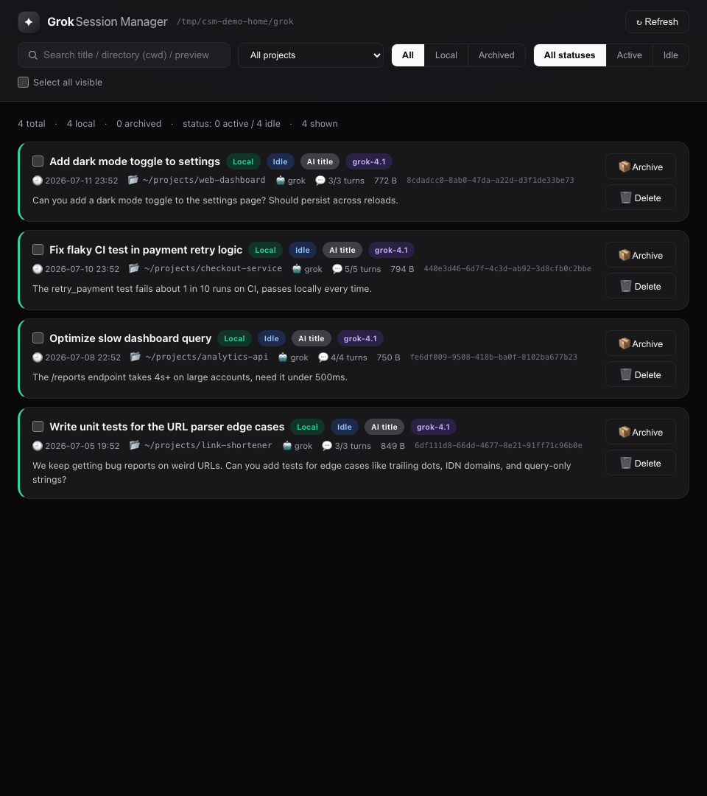

[English](./README.md) | [中文](./README.zh-CN.md)

# Chat Session Managers for macOS

[](https://github.com/czxxxczx73-cell/chat-session-managers/actions/workflows/ci.yml)
[](https://github.com/czxxxczx73-cell/chat-session-managers/releases/latest)
[](https://github.com/czxxxczx73-cell/chat-session-managers/releases/latest)
[](https://github.com/czxxxczx73-cell/chat-session-managers/releases/latest)
[](./PRIVACY.md)
[](./LICENSE)

Three focused macOS apps for browsing and managing conversation history stored locally by **Codex**, **Claude Code**, and **Grok**. The release uses a compact native Universal 2 host while preserving the original card-based interface exactly.

| Codex | Claude Code | Grok |
|---|---|---|
|  |  |  |

All screenshots contain fictional demo data. The interface automatically follows the macOS/browser language, with complete English and Simplified Chinese UI.

## Download

1. Open the [latest release](https://github.com/czxxxczx73-cell/chat-session-managers/releases/latest).
2. Download the `Chat-Session-Managers-v<version>-universal.zip` asset.
3. Unzip it and move any or all three Apps to `Applications`.
4. On first launch, macOS may require **right-click → Open** because the Apps are ad-hoc signed rather than Apple-notarized.

The same package runs on Apple Silicon and Intel Macs. The native host is compact and does not bundle pywebview/pyobjc. A locally installed **Python 3.9 or later** is required for the standard-library session service; common Homebrew, python.org, and system locations are detected automatically.

## What stays local

- No analytics, telemetry, account system, cloud database, CDN, or outbound request
- The WebKit host blocks navigation outside `127.0.0.1` / `localhost`
- The Python service binds only to a random loopback port and stops with its parent App
- Search, filters, and refresh are read-only
- Archive, restore, and delete require an explicit button action
- Delete creates a recoverable local backup before removing the original
- Claude refresh never auto-deletes transcripts based on temporary Desktop registry differences

See [PRIVACY.md](./PRIVACY.md) and [SECURITY.md](./SECURITY.md) for details.

## Features

- Search by title, folder, or preview text
- Filter by project, archive state, and source
- Browse titles, timestamps, paths, turns, models, versions, and previews
- Multi-select actions where supported
- Archive, restore, and backed-up delete
- Detect running Codex / Claude Code sessions and show conflict warnings
- English and Simplified Chinese interface

| App | Local source | Actions |
|---|---|---|
| Codex | `~/.codex/sessions`, `~/.codex/archived_sessions` | Uses the official `codex` CLI for archive, restore, and delete |
| Claude Code | `~/.claude/projects/**/*.jsonl` plus optional Claude Desktop registry metadata | Moves selected transcripts between active/archive folders; Desktop-only entries remain read-only |
| Grok | `~/.grok/sessions` | Moves selected session directories between active/archive folders |

Backups are written to each tool's local `deleted_sessions` directory before delete.

## The UI is intentionally locked

The three `index.html` files remain byte-for-byte identical to the Claude-published card layout shown above. CI verifies their SHA-1 hashes and fails if the internal visual structure changes. Version 2 changes the host, packaging, safety checks, localization metadata, and GitHub release experience—not the App layout.

## Build and verify

Requirements: macOS 13+, Xcode Command Line Tools, and Python 3.9+.

```bash
git clone https://github.com/czxxxczx73-cell/chat-session-managers.git
cd chat-session-managers
make check test package
```

- `make check` locks the UI and audits paths, telemetry, and outbound runtime URLs.
- `make test` verifies read-only refresh against isolated fictional fixtures.
- `make package` creates the direct Universal 2 release, ready under `dist/`.

Contributions are welcome; see [CONTRIBUTING.md](./CONTRIBUTING.md). Licensed under [MIT](./LICENSE).
