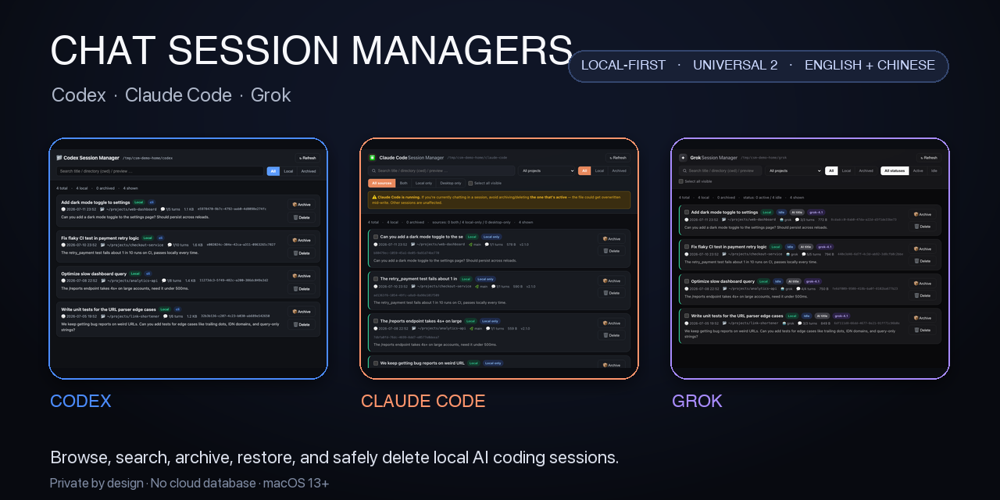
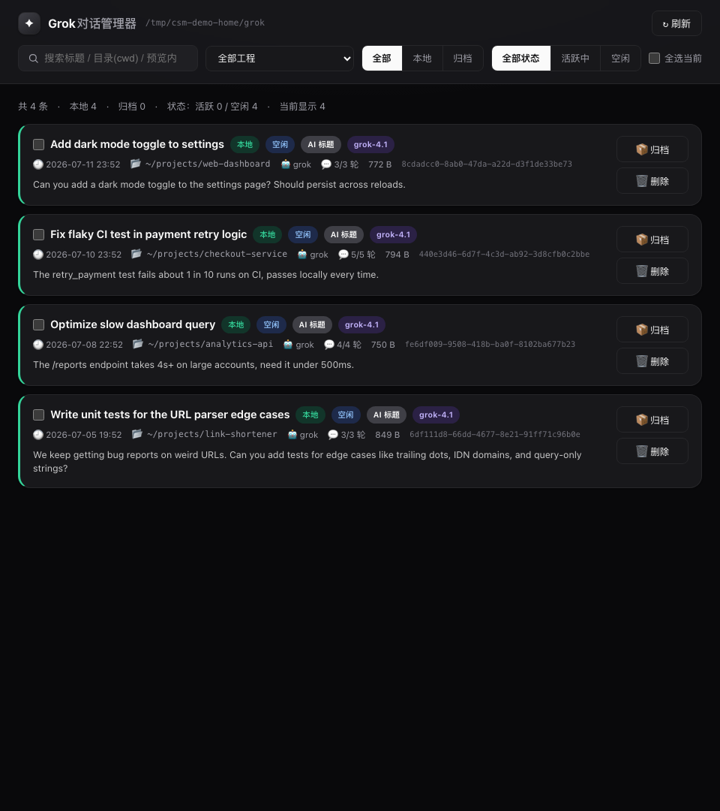

[English](./README.md) | [中文](./README.zh-CN.md)

# macOS 对话管理器 — Codex、Claude Code 与 Grok 本地历史

[](https://github.com/czxxxczx73-cell/chat-session-managers/releases/download/v2.0.1/chat-session-managers-functional-demo.mp4)

<p align="center">
  <strong><a href="https://github.com/czxxxczx73-cell/chat-session-managers/releases/latest">下载最新版本</a></strong>
  ·
  <strong><a href="https://github.com/czxxxczx73-cell/chat-session-managers/releases/download/v2.0.1/chat-session-managers-functional-demo.mp4">观看 24 秒功能演示</a></strong>
  ·
  <a href="https://github.com/czxxxczx73-cell/chat-session-managers/discussions">参与讨论</a>
</p>

[](https://github.com/czxxxczx73-cell/chat-session-managers/actions/workflows/ci.yml)
[](https://github.com/czxxxczx73-cell/chat-session-managers/releases/latest)
[](https://github.com/czxxxczx73-cell/chat-session-managers/releases)
[](https://github.com/czxxxczx73-cell/chat-session-managers/stargazers)
[](https://github.com/czxxxczx73-cell/chat-session-managers/releases/latest)
[](https://github.com/czxxxczx73-cell/chat-session-managers/releases/latest)
[](./PRIVACY.md)
[](./LICENSE)
[](https://github.com/jaywcjlove/awesome-swift-macos-apps#ai)

三款专门管理本地对话历史的 macOS App，分别支持 **Codex、Claude Code、Grok**。发布版换成了轻量 Universal 2 原生宿主，但完整保留原来的卡片式界面和排版。

它不是把三种数据导入一个统一数据库，而是三款相互独立的轻量 App。每款都直接读取对应工具原有的本地格式，你只安装自己需要的，全部对话仍留在这台 Mac 上。

| Codex | Claude Code | Grok |
|---|---|---|
|  |  |  |

所有截图均为虚构演示数据。界面会自动跟随 macOS / 浏览器语言，完整支持简体中文和英文。

## 观看实际功能

[**观看 24 秒功能演示 →**](https://github.com/czxxxczx73-cell/chat-session-managers/releases/download/v2.0.1/chat-session-managers-functional-demo.mp4) · [在 X 查看视频讨论串](https://x.com/czxxxxem/status/2077606819057332303)

演示使用隔离的虚构数据，展示真实功能流程：搜索本地会话、按来源筛选 Claude 记录、多选并批量归档、切换 Grok 活跃/空闲状态，以及删除前查看可恢复备份和运行冲突提示。

## 直接下载

1. 打开 [最新 Release](https://github.com/czxxxczx73-cell/chat-session-managers/releases/latest)。
2. 下载 `Chat-Session-Managers-v<版本号>-universal.zip`。
3. 解压后，把需要的 App 拖入“应用程序”。
4. 当前为本地签名、未做 Apple 公证，因此首次启动可能需要 **右键 App → 打开**。

同一个发布包原生支持 Apple 芯片和 Intel Mac。轻量宿主不再打包 pywebview/pyobjc，但本机需要有 **Python 3.9 或更高版本**；程序会自动查找 Homebrew、python.org 和系统常见安装位置。

## 本地与隐私

- 没有分析、遥测、账户系统、云端数据库、CDN 或外部网络请求
- WebKit 宿主禁止跳转到 `127.0.0.1` / `localhost` 以外的地址
- Python 服务只监听随机的本机回环端口，并跟随父 App 退出
- 搜索、筛选和刷新全部只读
- 归档、恢复和删除必须显式点击按钮
- 删除前会先创建可恢复的本地备份
- Claude 刷新不会再根据 Desktop 登记区的临时差异自动删除 transcript

详见 [PRIVACY.md](./PRIVACY.md) 和 [SECURITY.md](./SECURITY.md)。

## 功能

- 按标题、目录和预览内容搜索
- 按工程、归档状态和来源筛选
- 查看标题、时间、路径、轮数、模型、版本和预览
- 支持批量选择（对应 App 支持时）
- 归档、恢复和先备份后删除
- 检测正在运行的 Codex / Claude Code 会话并显示冲突提示
- 完整中英文界面

| App | 本地数据来源 | 操作方式 |
|---|---|---|
| Codex | `~/.codex/sessions`、`~/.codex/archived_sessions` | 调用官方 `codex` 命令归档、恢复和删除 |
| Claude Code | `~/.claude/projects/**/*.jsonl`，以及可选的 Claude Desktop 登记信息 | 在活动/归档目录之间移动所选 transcript；仅 Desktop 记录保持只读 |
| Grok | `~/.grok/sessions` | 在活动/归档目录之间移动所选会话目录 |

删除前的备份保存在每个工具本地的 `deleted_sessions` 目录。

## UI 排版被严格锁定

三份 `index.html` 与 Claude 发布的卡片式排版逐字节一致。CI 会校验 SHA-1，只要内部视觉结构发生变化就直接失败。2.0 版改变的是宿主、打包、安全检查、语言元数据和 GitHub 发布体验，不是 App 里面的排版。

## 构建与验证

需要 macOS 13+、Xcode Command Line Tools 和 Python 3.9+。

```bash
git clone https://github.com/czxxxczx73-cell/chat-session-managers.git
cd chat-session-managers
make check test package
```

- `make check`：锁定 UI，并检查本机路径、遥测和外部运行时 URL。
- `make test`：使用隔离的虚构数据验证刷新只读。
- `make package`：生成直接下载的 Universal 2 发布包，产物在 `dist/` 下。

欢迎贡献，参见 [CONTRIBUTING.md](./CONTRIBUTING.md)。项目采用 [MIT](./LICENSE) 许可证。


## 收录

- 已收录于 [Awesome Swift macOS Apps](https://github.com/jaywcjlove/awesome-swift-macos-apps)（AI 分类）

## 支持

如果这些 App 帮你整理 Codex / Claude Code / Grok 本地历史，请给仓库点个 **Star**——这是让更多 macOS 用户发现本地优先工具的最快方式。

- 下载：[最新 Release](https://github.com/czxxxczx73-cell/chat-session-managers/releases/latest)
- 演示：[24 秒功能演示](https://github.com/czxxxczx73-cell/chat-session-managers/releases/download/v2.0.1/chat-session-managers-functional-demo.mp4)
- 隐私：[PRIVACY.md](./PRIVACY.md)
- 问题 / 想法：[GitHub Issues](https://github.com/czxxxczx73-cell/chat-session-managers/issues)
- 问答 / 展示：[GitHub Discussions](https://github.com/czxxxczx73-cell/chat-session-managers/discussions)
